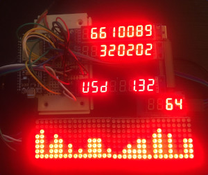

[](https://github.com/blockfrost/blockfrost-arduino/actions/workflows/platformio-build.yml)
[](https://fivebinaries.com/)


# blockfrost-arduino

<br/>

<p align="center">Arduino SDK for <a href="https://blockfrost.io">Blockfrost.io</a> API.</p>
<p align="center">
  <a href="#about">About</a> •
  <a href="#getting-started">Getting started</a> •
  <a href="#installation">Installation</a> •
  <a href="#usage">Usage</a>
</p>

<br/>

## About

Arduino SDK for the Blockfrost.io API targeting ESP32 development boards.

[](./img/proj.jpg)

## Getting started

To use this SDK, you first need to log in to [blockfrost.io](https://blockfrost.io), create your project and retrieve the API token.


<br/>

## Installation

The SDK uses [platformio](https://platformio.org/).

You can either work directly with this repository or add this package as a dependency of your project using


```
lib_deps =
  https://github.com/blockfrost/blockfrost-arduino
```

To enter a development shell, use `nix-shell`.

## Usage

To build the [example](./example), copy `example/creds.h.sample`
to `example/creds.h` and fill in your credentials.

```sh
git clone https://github.com/blockfrost/blockfrost-arduino
cd blockfrost-arduino
cp example/creds.h.sample example/creds.h
```

Plug in your ESP32 development board, build and upload
using:

```sh
pio run --target upload
```

### Testing

It is possible to test correct JSON (de)serialisation natively using:

```
pio test -c platformio-test.ini -e native
```
